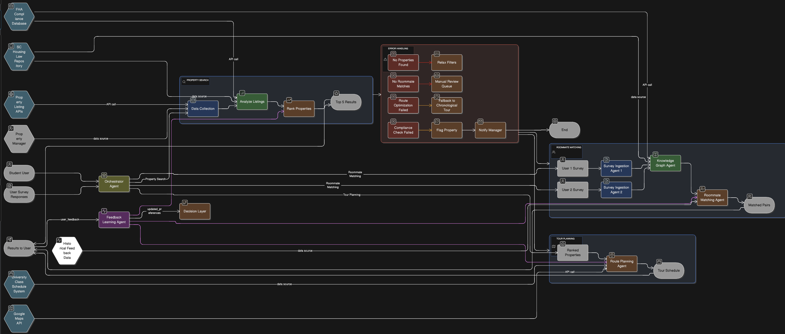

# RentConnect-C3AN: Multi-Agent Student Housing System


## What Is This?

RentConnect helps college students find safe off-campus housing and compatible roommates using AI agents that work together. Think of it as a smart system where different "agents" handle different tasks - one finds properties, another checks if they're safe, another matches you with roommates, etc.



## Why C³AN?

**C³AN = Custom, Compact, Composite AI Systems**

- **Custom**: Built specifically for student housing (not generic)
- **Compact**: Lightweight agents that are fast and efficient  
- **Composite**: Multiple specialized agents working together

### What Makes It Safe & Smart

✅ **Fair Housing Compliant**: Blocks discriminatory filters automatically  
✅ **Scam Detection**: Analyzes listings to catch fake properties  
✅ **Explainable Decisions**: Shows you WHY each property was ranked that way  
✅ **Learning System**: Gets better from your feedback  
✅ **Multi-Objective**: Balances price, commute, safety, and preferences  


## How It Works (3 Main Workflows)

**The Magic:** All workflows are driven by `rentconnect_agent_registry.json` — no hardcoded routing!

### 1. 🏠 Property Search
```
You search → System collects listings → Analyzes for scams → 
Checks compliance → Ranks by your preferences → Shows top 5
```

**What runs:**
- `DataIngestionAgent` - Collects listings from Zillow, Redfin, etc.
- `ListingAnalyzerAgent` - Detects scams and extracts features
- `ComplianceCheckerAgent` - Verifies FHA & safety rules
- `RankingScoringAgent` - Ranks properties by what you care about

### 2. 👥 Roommate Matching  
```
You fill survey → System validates it → Matches you with compatible people → 
Shows compatibility scores
```

**What runs:**
- `SurveyIngestionAgent` - Validates your survey responses
- `KnowledgeGraphAgent` - Checks Fair Housing rules
- `RoommateMatchingAgent` - Finds your best matches

### 3. 🗺️ Tour Planning
```
You pick properties → System plans optimal route → 
Fits around your class schedule → Gives you tour itinerary
```

**What runs:**
- `RankingScoringAgent` - Selects top properties
- `RoutePlanningAgent` - Plans efficient tour route

### Plus: Learning Loop
The `FeedbackLearningAgent` learns from your ratings and improves recommendations over time.

## Quick Start (Try It Now!)

### Run the System
```bash
python main.py
```
**What this does:** Runs all 3 workflows and shows results in your terminal

### How It's Different Now
✨ **Before:** 320+ lines of manual workflow code  
✨ **Now:** 50 lines — the `Orchestrator` reads the registry and routes data automatically

This is the **"Compact"** promise of C³AN in action.

## File Guide (What's What)

### 🚀 **Core Files** (Start here)
- **`main.py`** - Entry point - runs all workflows
- **`orchestrator.py`** - Registry-driven workflow engine (the "brain")
- **`rentconnect_agent_registry.json`** - Agent registry (defines who talks to who)

### 📋 **Legacy Files** (Informational only)
- **`quickstart.py`** - Old standalone demo
- **`agent_registry.json`** - Generic C³AN registry (not RentConnect-specific)

### 🔧 **Config Files**
- **`config.py`** - Main configuration settings
- **`config/`** - Agent-specific configs

### 📁 **Source Code** (`src/`)
```
src/
├── agents/              ← 11 AI agents (the brain)
│   ├── roommate_matching/
│   ├── ranking_scoring/
│   ├── route_planning/
│   └── feedback_learning/
├── tools/               ← Analysis utilities
│   ├── listing_analyzer.py
│   ├── image_analyzer.py
│   ├── compliance_checker.py
│   └── knowledge_graph.py
└── preprocessing/       ← Data collection
    ├── data_ingestion.py
    └── survey_ingestion.py
```

### 📊 **Documentation**
- **`README.md`** - This file (overview & how-to)
- **`SYSTEM_README.md`** - Technical system documentation
- **`workflow_diagrams.txt`** - Canva-ready workflow diagrams
- **`IMPLEMENTATION_SUMMARY.py`** - What we built summary

### 🧪 **Testing**
- **`test_system.py`** - Quick system verification
- **`main.py`** - Example workflow usage

## The 11 Agents (What Each One Does)

### 📥 **Data Collection** (Preprocessing)
1. **DataIngestionAgent** - Collects rental listings from Zillow, Redfin, Craigslist
2. **SurveyIngestionAgent** - Validates your roommate survey responses

### 🔍 **Analysis** (Tools)
3. **ListingAnalyzerAgent** - Detects scam listings, extracts features
4. **ImageAnalyzerAgent** - Checks if property photos are authentic
5. **ComplianceCheckerAgent** - Verifies Fair Housing Act & safety compliance
6. **KnowledgeGraphAgent** - Looks up housing laws and rules

### 🎯 **Decision Making** (Main Agents)
7. **RankingScoringAgent** - Ranks properties by your preferences
8. **RoommateMatchingAgent** - Finds compatible roommates for you
9. **RoutePlanningAgent** - Plans optimal property tour routes

### 🧠 **Learning**
10. **FeedbackLearningAgent** - Learns from your ratings to improve

### 🎼 **Coordination**
11. **OrchestrationAgent** - Coordinates all the agents (the conductor)

## Code Examples

### Example 1: Search for Properties
```python
from system_implementation import OrchestrationAgent

# Create orchestrator
orchestrator = OrchestrationAgent()

# Search for properties
result = orchestrator.execute_workflow(
    workflow_type="property_search",
    user_request={
        "sources": ["zillow", "redfin"],
        "filters": {"city": "Columbia", "max_price": 1500},
        "preferences": {
            "weights": {
                "price": 0.4,
                "commute_time": 0.3,
                "safety_score": 0.3
            }
        }
    }
)

# See top properties
print(result['results']['ranked_listings'][:5])
```

### Example 2: Match Roommates
```python
# Match roommates
result = orchestrator.execute_workflow(
    workflow_type="roommate_matching",
    user_request={
        "surveys": [
            {
                "user_id": "alice",
                "hard_constraints": {"smoking": False, "pets": True},
                "soft_preferences": {"cleanliness": 4, "social_level": 3}
            },
            {
                "user_id": "bob",
                "hard_constraints": {"smoking": False, "pets": True},
                "soft_preferences": {"cleanliness": 4, "social_level": 4}
            }
        ]
    }
)

# See matches
print(result['results']['matches'])
```

## Installation

### Prerequisites
- Python 3.11 or higher
- pip (Python package manager)

### Setup (3 Steps)
```bash
# 1. Install Python dependencies
pip install -r requirements.txt

# 2. Run a quick test
python3 test_system.py

# 3. Try the full demo
python3 system_implementation.py
```

That's it! No database setup, no API keys needed (uses mock data for now).

## Understanding the Agent Registry

The **`rentconnect_agent_registry.json`** file is like a phone book for agents. It lists:
- What each agent does
- What data it needs (inputs)
- What data it produces (outputs)
- How agents can talk to each other

**When to use it:**
- Setting up agent connections
- Understanding system architecture
- Adding new agents
- Debugging data flow issues

## Understanding the Connections

Agents pass data to each other like a relay race:

```
Property Search Flow:
DataIngestion → ListingAnalyzer → ComplianceChecker → Ranking → Results
      ↓              ↓                  ↓
   listings      risk_scores      safety_scores

Roommate Matching Flow:
SurveyIngestion → KnowledgeGraph → RoommateMatching → Results
       ↓               ↓                  ↓
   profiles      fha_rules          matches
```

See **`agent_connection_mappings.py`** for complete connection details.

## Project Status

**✅ Working:** All 3 workflows functional with test data  
**✅ Tested:** Property search, roommate matching, tour planning  
**🚧 In Progress:** External API integrations, real database  
**📋 Planned:** Mobile app, user authentication, payment processing

## Data Sources (For Production)

When ready for real deployment, you'll need:

### Property Data
- Zillow API (rental listings)
- Apartments.com API
- Craigslist scraping (with permission)

### Location Data
- Google Maps API (routing, commute times)
- Transit data (bus schedules)

### Compliance Data
- Fair Housing Act rules database
- State/local housing laws

### User Data
- Authentication system (Firebase, Auth0)
- Survey responses database
- Feedback and ratings

## Troubleshooting

### "Module not found" Error
```bash
# Make sure you're in the right directory
cd rent-connect-agent

# Install dependencies
pip install -r requirements.txt
```

### "No such file" Error
```bash
# Check you have the registry file
ls rentconnect_agent_registry.json

# If missing, it should be in the project root
```

### Agents Not Connecting
```bash
# Run the connection example to verify
python3 agent_connections_example.py
```

## Next Steps for Development

1. **This Week** (Week of Nov 18, 2025):
   - Create data registry (define all data schemas)
   - Identify knowledge assets needed (FHA rules, housing laws)
   - List external APIs required

2. **Future Weeks**:
   - Connect real APIs (Zillow, Google Maps)
   - Build proper database
   - Add authentication
   - Create mobile app frontend

## Learn More

- **`SYSTEM_README.md`** - Deep technical documentation
- **`workflow_diagrams.txt`** - Visual workflow diagrams for Canva
- **`agent_connection_mappings.py`** - Complete connection reference
- **`IMPLEMENTATION_SUMMARY.py`** - Summary of what was built

## Contributing

Want to add features or fix bugs?

1. Fork the repository
2. Create a feature branch (`git checkout -b feature/cool-feature`)
3. Make your changes
4. Test with `python3 test_system.py`
5. Submit a pull request

## License

MIT License - Free to use, modify, and distribute.

## Contact

**Developer:** Leeon Israel  
**Institution:** University of South Carolina (USC)  
**Project:** RentConnect-C3AN Multi-Agent Housing System

---

**🎯 Goal:** Help students find safe, affordable housing with AI agents that actually explain their decisions.
